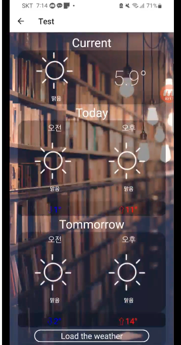
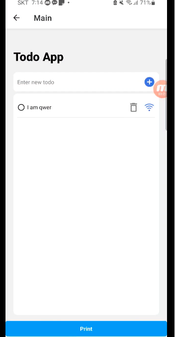

# 오픈소프트웨어개발 16조 레포지토리입니다.


오픈소프트웨어 개발  16조의 레포지터리 입니다.


## Introduction

Wifi Reminder는 사용자의 다양한 조건에 맞춰 유연한 일정관리, 알람설정으로 할 수 있게 하는 오픈소스 프로젝트 입니다.

## background

저희는 기존 어플들이 오직 시간, 위치 등의 제한적인 조건만 설정할 수 있다는 점에서 불만을 느꼈고, 사용자 개개인에 맞춰 유연한 조건에 맞춰 일정을 짤 수 있는 어플을 구상 하였습니다.

계정 연동을 통해 설정한 알람들을 통해 사용자는 자신에게 맞는 설정들을 저장하고, 사용자는 언제 어디서든 어느 디바이스에서든 이 알람들을 즉시 불러와 사용할 수 있게 하려고 노력했습니다.

더 나아가, 우리의 앱은 단순한 알람 시스템을 뛰어넘어 스마트한 기능을 제공합니다. 시간과 상황을 고려하여 발동되는 알람 기능을 통해, 사용자는 자신의 일상에 맞게 최적화된 알람을 설정하고 필요에 따라 신속하게 삭제하는 기능을 제공하고자 하였습니다. 이를통해 사용자가 자유롭게 일상을 계획하고 조절할 수 있으리라 예상했습니다.

또한, 날씨 정보를 자동으로 조회하여 사용자가 조금 더 준비 된 하루를 시작할 수 있도록 지원합니다.

## how to develop

```
    git clone https://github.com/kimbamtol/Open-Source-16.git
```

### for Anround

안드로이드 스튜디오가 다운로드 되어 있어야 합니다.  
[Android Studio](https://developer.android.com/studio?gclid=CjwKCAiAx_GqBhBQEiwAlDNAZrEuY5uKb6-zGLpf4XJco0gLqfaAQxA61ZUer-XsdQ34_ErE9PGV0RoCjX8QAvD_BwE&gclsrc=aw.ds&hl=ko "Android")

```
    npm i  // 필요한 dependenies들을 다운받아 줍니다
    npm run android
```

error 가 발생한다면, gradle 과 java sdk의 버전을 맞춰주는 것이 필요합니다.  
[Gradle version config](https://docs.gradle.org/current/userguide/compatibility.html#:~:text=A%20Java%20version%20between%208,versions%20are%20not%20yet%20supported. "gradle")

local.properties에서 /taekyoung/을 본인 유저 이름으로 바꾸시고
npm run android 하면 실행 될겁니다 (mac기준)

### for IOS

준비중...

## Feature

### **log in**

      


로그인 기능입니다. 서버와 연결을 통해 어떤 디바이스에서도 사용가능하게 준비하고 있습니다.

### weather Check


   
오늘과 내일의 날씨를 확인할 수 있습니다.

### ToDo



와이파이 이름을 감지하여 발동하는 알람을 설정할 수 있습니다.  
추후에 더 많은 설정 요소들이 추가 될 예정입니다.

## how to contribute

앞서 소개한 feature별로 브랜치를 파 개발을 진행할 수 있습니다.  
[logIn,weather, toDo, etc, newFeature] 등의 브랜치로 분리해 개발 진행할 수 있습니다.

issue 를 설정할때는,

#### 현재상황 개선상황 개선방법 등을 필수로 포함하고 있어야 합니다

### Best Practice

#### 제안
사용,개발중 발견한 버그나 개선사항을 자세하게 작성하고, 기능을 제안 해 주세요.
ex) wifi뿐만 아니라 날씨정보를 인식하여 알람을 설정하고 싶습니다.

#### 개선상황 
매일 알람이나 날씨를 확인할 필요없이, 특정 조건(기온,기후)가 성립되면 알람이 울려서 간편합니다.

#### 개선방법
알람을 설정한 시간이 되면, 백그라운드에서 날씨 api에 정보를 요청해 특정조건이 성립하는지 확인합니다. 
날씨 정보확인 api가 설정이 되어 있으니 사용하면 될 거 같습니다.

#### 추가 
위의 항목들 이외에 덧붙이고 싶은 코멘트를 작성하시면 됩니다. 

## Licensing

Wifi Reminder은 [Mit Licnese](https://github.com/PowerShell/PowerShell/blob/master/LICENSE.txt "MIt")로 관리됩니다.
